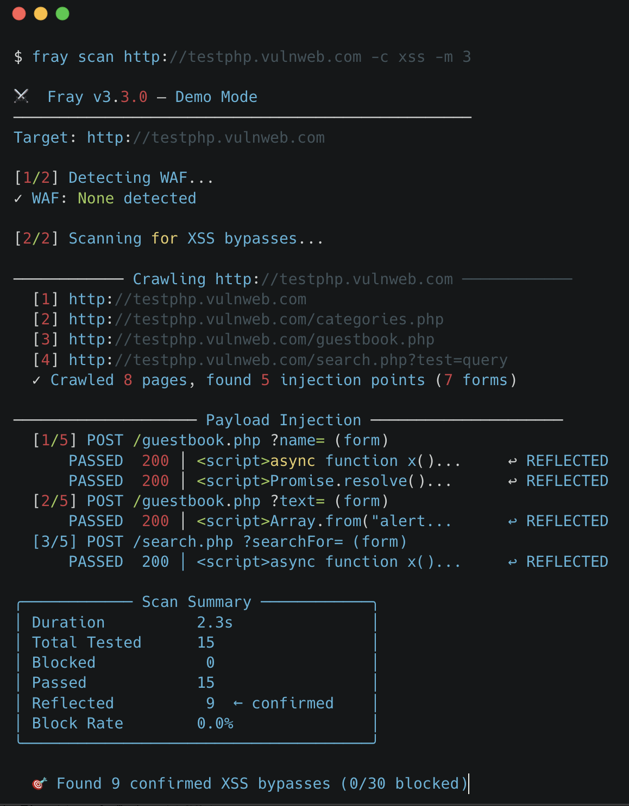
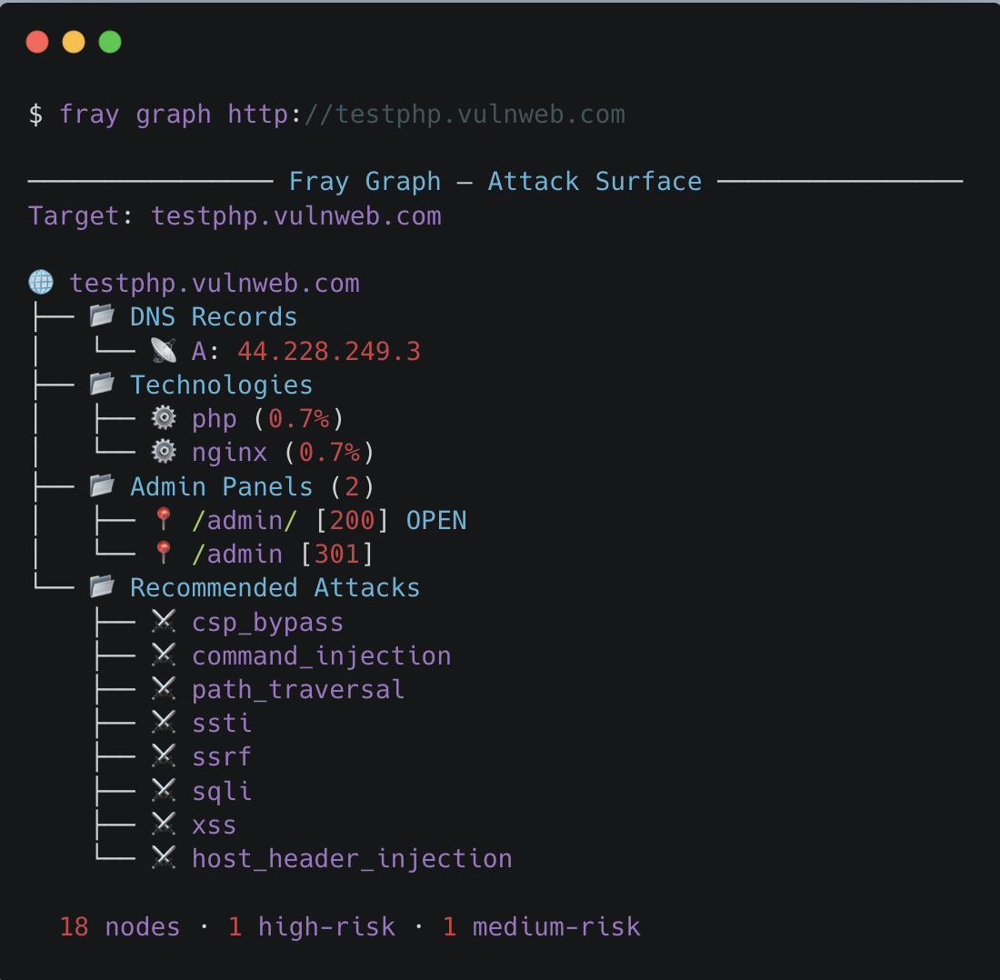

# Fray — WAF Bypass & Security Testing Toolkit

**🌐 Language:** **English** | [日本語](README.ja.md)

### ⚔️ *Open-source penetration testing tool for web application firewalls — recon, scan, bypass, harden*

Fray is a fast, open-source **web application security** scanner and **WAF bypass** toolkit for penetration testers, bug bounty hunters, and DevSecOps teams. It combines a 6,300+ payload database, 27-check reconnaissance, AI-assisted WAF evasion, and OWASP hardening audits into a single `pip install` with zero dependencies.

[](https://github.com/dalisecurity/fray)
[](https://github.com/dalisecurity/fray)
[](https://github.com/dalisecurity/fray)
[](https://github.com/dalisecurity/fray)

[](https://pypi.org/project/fray/)
[](https://www.python.org/downloads/)
[](LICENSE)
[](https://github.com/dalisecurity/fray/stargazers)

> **FOR AUTHORIZED SECURITY TESTING ONLY** — Only test systems you own or have explicit written permission to test.

---

## Why Fray?

Most payload collections are static text files. Fray is a **complete workflow**:

- **`fray auto`** — Full pipeline: recon → scan → ai-bypass in one command *(new)*
- **`fray scan`** — Auto crawl → param discovery → payload injection
- **`fray recon`** — 27 automated checks (TLS, headers, DNS, CORS, params, JS, history, GraphQL, API, Host injection, admin panels)
- **`fray ai-bypass`** — LLM-assisted adaptive bypass with response diffing + header manipulation *(new)*
- **`fray bypass`** — 5-phase WAF evasion scorer with mutation feedback loop
- **`fray harden`** — OWASP Top 10 misconfig checks + security header audit with fix snippets *(new)*
- **`fray detect`** — Fingerprint 25 WAF vendors
- **`fray test`** — 6,300+ payloads across 24 OWASP categories
- **Zero dependencies** — pure Python stdlib, `pip install fray` and go

## Who Uses Fray?

- **Bug Bounty Hunters** — Discover hidden params, old endpoints, bypass Cloudflare/AWS WAF/Akamai, file reports
- **Pentesters** — Full reconnaissance + automated vulnerability scanning with client-ready HTML reports
- **Blue Teams** — Validate WAF rules, regression test after config changes
- **DevSecOps** — DAST in CI/CD pipelines, fail builds on WAF bypasses
- **Security Researchers** — Find WAF evasion techniques, contribute payloads
- **Students** — Interactive CTF tutorials, learn OWASP Top 10 attack vectors hands-on

---

## Quick Start

```bash
pip install fray                # PyPI (all platforms)
sudo apt install fray            # Kali Linux / Debian
brew install fray                # macOS
```

```bash
fray auto https://example.com                    # Full pipeline: recon → scan → bypass
fray scan https://example.com                    # Auto scan (crawl + inject)
fray recon https://example.com                   # 27-check reconnaissance
fray ai-bypass https://example.com               # AI-assisted adaptive bypass
fray bypass https://example.com -c xss           # WAF evasion scorer
fray harden https://example.com                  # OWASP hardening audit
fray test https://example.com --smart            # Smart payload testing
fray detect https://example.com                  # WAF detection
fray explain CVE-2021-44228                      # CVE intelligence
```

<p align="center">
  
</p>

---

## Command Summary

| Command | What it does |
|---------|-------------|
| **`fray auto`** | Full pipeline: recon → scan → ai-bypass with recommendations between phases |
| **`fray scan`** | Crawl → discover params → inject payloads → detect reflection |
| **`fray recon`** | 27 checks: TLS, headers, DNS, subdomains, CORS, params, JS, API, admin panels, WAF intel |
| **`fray ai-bypass`** | Adaptive bypass: probe WAF → generate payloads (LLM or local) → test → mutate → header tricks |
| **`fray bypass`** | 5-phase WAF evasion: probe → rank → test → mutate blocked → brute-force fallback |
| **`fray harden`** | Security headers audit (A-F grade) + OWASP Top 10 misconfig checks + fix snippets |
| **`fray test`** | Test 6,300+ payloads across 24 categories with adaptive throttling |
| **`fray detect`** | Fingerprint 25 WAF vendors |
| **`fray report`** | HTML/Markdown reports from scan results |
| **`fray explain`** | CVE intelligence with payloads, or human-readable findings |
| **`fray diff`** | Before/after regression testing (CI/CD gate) |
| **`fray graph`** | Visual attack surface tree |

---

## `fray auto` — Full Pipeline

```bash
fray auto https://example.com -c xss
fray auto https://example.com --skip-recon       # Skip recon, run scan + bypass only
fray auto https://example.com --json -o report.json
```

Runs **recon → scan → ai-bypass** end-to-end with recommendations between each phase. Outputs a pipeline summary with next steps.

---

## `fray scan` — Automated Attack Surface Mapping

```bash
fray scan https://example.com -c xss -m 3 -w 4
fray scan https://target.com --scope scope.txt --stealth   # Bug bounty
fray scan https://target.com --json -o results.json        # CI/CD
```

Crawls → discovers injection points (forms, URL params, JS APIs) → tests payloads → detects reflection (`↩ REFLECTED`). Auto-backoff on 429 rate limits.

<p align="center">
  
</p>

[Full scan options + examples →](docs/scanning-guide.md)

---

## `fray recon` — 27 Automated Checks

```bash
fray recon https://example.com
fray recon https://example.com --js --history --params   # Full depth
```

| Check | What It Finds |
|-------|---------------|
| **Parameter Discovery** | Query strings, form inputs, JS API endpoints |
| **Parameter Mining** | Brute-force 136 common param names |
| **JS Endpoint Extraction** | LinkFinder-style: hidden APIs, cloud buckets, leaked secrets |
| **Historical URLs** | Wayback Machine, sitemap.xml, robots.txt |
| **GraphQL Introspection** | 10 common paths, exposed schema |
| **API Discovery** | Swagger/OpenAPI specs, versioned API roots |
| **Host Header Injection** | Password reset / cache poisoning via `Host:` manipulation |
| **Admin Panel Discovery** | 70 paths: `/admin`, `/wp-admin`, `/phpmyadmin`, `/actuator` |
| **TLS / Headers / Cookies** | Cert, HSTS, CSP, HttpOnly, SameSite |
| **DNS / CORS / Fingerprint** | CDN detection, CORS misconfig, tech stack |
| **WAF Mode + Gap Analysis** | Signature vs anomaly vs hybrid, known bypass matrix |

Plus: 28 exposed file probes (`.env`, `.git`, phpinfo) · subdomains via crt.sh · rate limit fingerprinting

[Recon guide →](docs/quickstart.md)

---

## `fray ai-bypass` — AI-Assisted Adaptive Bypass

```bash
fray ai-bypass https://example.com -c xss --rounds 3
OPENAI_API_KEY=sk-... fray ai-bypass https://example.com   # LLM mode
```

| Phase | What happens |
|-------|--------------|
| **Probe** | Learn WAF behavior: blocked tags, events, keywords, strictness |
| **Generate** | LLM or smart local engine creates targeted payloads |
| **Test + Diff** | Response diffing: soft blocks, challenges, reflection |
| **Adapt** | Feed results back → re-generate smarter payloads |
| **Headers** | X-Forwarded-For, Transfer-Encoding, Content-Type confusion |

**Providers:** OpenAI (`OPENAI_API_KEY`), Anthropic (`ANTHROPIC_API_KEY`), or local (no key needed).

## `fray harden` — OWASP Hardening Audit

```bash
fray harden https://example.com
fray harden https://example.com --json -o audit.json
```

Checks security headers (HSTS, CSP, COOP, CORP, Permissions-Policy, rate-limit headers) with **A-F grade**, plus OWASP Top 10 misconfiguration checks (A01 Access Control, A02 Crypto, A05 Misconfig, A06 Components, A07 Auth). Outputs copy-paste fix snippets for **nginx, Apache, Cloudflare Workers, and Next.js**.

## `fray detect` — 25 WAF Vendors

```bash
fray detect https://example.com
```

Cloudflare, AWS WAF, Akamai, Imperva, F5 BIG-IP, Fastly, Azure WAF, Google Cloud Armor, Sucuri, Fortinet, Wallarm, Vercel, and 13 more. Identifies signature-based, anomaly-based, and hybrid WAF modes — essential for choosing the right bypass strategy.

[Detection signatures →](docs/waf-detection-guide.md)

---

## Key Features

| Feature | How | Example |
|---------|-----|---------|
| **Scope Enforcement** | Restrict to permitted domains/IPs/CIDRs | `--scope scope.txt` |
| **Concurrent Scanning** | Parallelize crawl + injection (~3x faster) | `-w 4` |
| **Stealth Mode** | Randomized UA, jitter, throttle — one flag | `--stealth` |
| **Authenticated Scanning** | Cookie, Bearer, custom headers | `--cookie "session=abc"` |
| **CI/CD** | GitHub Actions with PR comments + fail-on-bypass | `fray ci init` |

[Auth guide →](docs/authentication-guide.md) · [Scan options →](docs/scanning-guide.md) · [CI guide →](docs/quickstart.md)

---

## 6,300+ Payloads · 24 Categories · 162 CVEs

The largest open-source WAF payload database — curated for real-world penetration testing and bug bounty hunting.

| Category | Count | Category | Count |
|----------|-------|----------|-------|
| XSS (Cross-Site Scripting) | 851 | SSRF | 71 |
| SQL Injection | 141 | SSTI | 205 |
| Command Injection (RCE) | 118 | XXE | 151 |
| Path Traversal (LFI/RFI) | 277 | AI/LLM Prompt Injection | 370 |

```bash
fray explain log4shell    # CVE intelligence with payloads
fray explain results.json # Human-readable findings: impact, remediation, next steps
fray payloads             # List all 24 payload categories
```

[Payload database →](docs/payload-database-coverage.md) · [CVE coverage →](docs/cve-real-world-bypasses.md)

---

## More Commands

```bash
fray graph example.com --deep       # Visual attack surface tree (27 checks)
fray scan target.com --ai           # LLM-optimized JSON for AI agents
fray scan target.com --sarif -o r.sarif  # SARIF → GitHub Security tab
fray diff before.json after.json    # Regression testing (exit 1 on bypass)
```

<p align="center">
  
</p>

## MCP Server — AI Agent Integration

Fray exposes 14 tools via the [Model Context Protocol (MCP)](https://modelcontextprotocol.io/) — use Fray as an AI security agent from Claude Desktop, Claude Code, ChatGPT, Cursor, or any MCP-compatible client.

```bash
pip install 'fray[mcp]'
```

Add to `~/Library/Application Support/Claude/claude_desktop_config.json`:

```json
{
  "mcpServers": {
    "fray": {
      "command": "python",
      "args": ["-m", "fray.mcp_server"]
    }
  }
}
```

Ask: *"What XSS payloads bypass Cloudflare?"* → Fray's 14 MCP tools are called directly.

<details>
<summary><b>14 MCP Tools</b></summary>

| Tool | What it does |
|------|-------------|
| `list_payload_categories` | List all 24 attack categories |
| `get_payloads` | Retrieve payloads by category |
| `search_payloads` | Full-text search across 6,300+ payloads |
| `get_waf_signatures` | WAF fingerprints for 25 vendors |
| `get_cve_details` | CVE lookup with payloads and severity |
| `suggest_payloads_for_waf` | Best bypass payloads for a specific WAF |
| `analyze_scan_results` | Risk assessment from scan/test JSON |
| `generate_bypass_strategy` | Mutation strategies for blocked payloads |
| `explain_vulnerability` | Beginner-friendly payload explanation |
| `create_custom_payload` | Generate payloads from natural language |
| `ai_suggest_payloads` | Context-aware payload generation with WAF intel |
| `analyze_response` | False negative detection: soft blocks, challenges, reflection |
| `hardening_check` | Security headers audit with grade + rate-limit check |
| `owasp_misconfig_check` | OWASP A01/A02/A03/A05/A06/A07 checks |

</details>

[Claude Code guide →](docs/claude-code-guide.md) · [ChatGPT guide →](docs/chatgpt-guide.md) · [mcp.json →](mcp.json)

---

<details>
<summary><b>Roadmap</b></summary>

- [x] Full pipeline: `fray auto` (recon → scan → ai-bypass)
- [x] AI-assisted bypass with LLM integration (OpenAI/Anthropic)
- [x] 5-phase WAF evasion scorer with mutation feedback loop
- [x] OWASP hardening checks + security header audit
- [x] 20-strategy payload mutation engine
- [x] Auto scan: crawl → discover → inject (`fray scan`)
- [x] 27-check reconnaissance, smart mode, WAF detection
- [x] 14 MCP tools, HTML/Markdown reports, SARIF output
- [ ] HackerOne API integration (auto-submit findings)
- [ ] Web-based report dashboard

</details>

---

## How Fray Compares

| | Fray | Nuclei | XSStrike | wafw00f | sqlmap |
|-|------|--------|----------|---------|--------|
| **WAF bypass engine** | ✅ AI + mutation | ❌ | Partial | ❌ | Tamper scripts |
| **WAF detection** | 25 vendors + mode | Via templates | Basic | 150+ vendors | Basic |
| **Recon pipeline** | 27 checks | Separate tools | Crawl only | ❌ | ❌ |
| **Payload database** | 6,300+ built-in | Community templates | XSS only | ❌ | SQLi only |
| **OWASP hardening** | ✅ A-F grade | ❌ | ❌ | ❌ | ❌ |
| **MCP / AI agent** | 14 tools | ❌ | ❌ | ❌ | ❌ |
| **Zero dependencies** | ✅ stdlib only | Go binary | pip | pip | pip |

Fray is not a replacement for these tools — it fills the gap between WAF detection (wafw00f) and exploitation (sqlmap/XSStrike) with a complete **detect → recon → bypass → harden** workflow.

---

## Contributing

See [CONTRIBUTING.md](CONTRIBUTING.md).

## Legal

**MIT License** — See [LICENSE](LICENSE). Only test systems you own or have explicit authorization to test.

**Security issues:** soc@dalisec.io · [SECURITY.md](SECURITY.md)

---

**[📖 All Documentation (30 guides)](docs/) · [PyPI](https://pypi.org/project/fray/) · [Issues](https://github.com/dalisecurity/fray/issues) · [Discussions](https://github.com/dalisecurity/fray/discussions)**

---

## Related Projects

- [wafw00f](https://github.com/EnableSecurity/wafw00f) — WAF fingerprinting and detection (150+ vendors)
- [WhatWaf](https://github.com/Ekultek/WhatWaf) — WAF detection and bypass tool
- [XSStrike](https://github.com/s0md3v/XSStrike) — Advanced XSS scanner with WAF evasion
- [sqlmap](https://github.com/sqlmapproject/sqlmap) — SQL injection detection and exploitation
- [Nuclei](https://github.com/projectdiscovery/nuclei) — Template-based vulnerability scanner
- [PayloadsAllTheThings](https://github.com/swisskyrepo/PayloadsAllTheThings) — Web security payloads and bypasses
- [SecLists](https://github.com/danielmiessler/SecLists) — Security assessment wordlists
- [Awesome WAF](https://github.com/0xInfection/Awesome-WAF) — Curated list of WAF tools and bypasses

<!-- mcp-name: io.github.dalisecurity/fray -->
